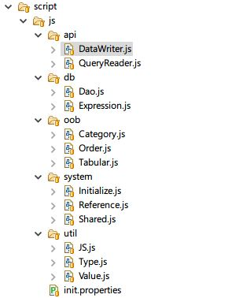
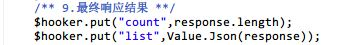

# Script Engine文档

## 1.脚本介绍

脚本加载顺序在`init.properties`中有如下定义：

	# ------------------------------------------------------
	# Global Variable Environment Initialize
	# ------------------------------------------------------
	1=system/Initialize.js
	2=util/JS.js
	3=util/Type.js
	4=util/Value.js
	5=db/Expression.js
	6=db/Dao.js
	7=api/QueryReader.js
	8=api/DataWriter.js
	9=system/Shared.js
	10000=system/Reference.js

### 1.1.Package介绍

* oob：动态加载库函数，OOB Package专用脚本
* system：初始化全局变量以及最终Reference引用脚本，Shared变量专用脚本
* util：工具类脚本
* db：数据库访问专用脚本
* api：脚本引擎简化专用脚本

### 1.2.Class列表

所有的系统脚本都使用了JavaScript原型定义，即支持Class的定义模式，所有类都位于system树下边，并且可直接使用短名模式，例如：

* 名称：system.js（脚本引擎中不推荐使用system.js的模式访问Api）
* 短名：Js

所有类以及短名清单如下：

* $ID——系统名称：`system.ID`，字符串类型，值为`uniqueId`，服务端Record的ID字段名
* Cond——系统名称：`system.query.Cond`，条件类，提供Expression条件生成器
* MatchMode——系统名称：`system.query.MatchMode`，模式类，主要应用于LikeExpression中的不同模式
* Type——系统名称：`system.type`，类型类，创建底层需要使用的时钟类型，让Js和Java类型进行转换
* Value——系统名称：`system.value`，值转换专用，用于执行各种不同的值转换
* Dao——系统名称：`system.dao`，数据库访问接口，提供底层访问数据库的能力
* Js——系统名称：`system.js`，JavaScript专用函数，执行JavaScript原生语言工具
* Shared——系统名称：`system.shared`，In/Out脚本中共享变量的脚本类
* Tool——（类）基础工具类
* Import——（函数）动态加载OOB库的入口函数
* __QueryEngine——（函数）查询数据库专用API
* __DataWriter——（函数）插入数据库专用API
* __DataUpdater——（函数）更新数据库专用API

### 1.3.预定义变量

**In脚本**

* $data：Web请求Json格式数据，该变量为JavaScript原生对象，可直接使用下边的代码访问：

		$data["username"]		// username为Http请求的参数名
* $env：引擎专用环境变量引用，该引用为Java类型：`com.vie.orb.impl.Eidolon`，该类型中包含了Engine专用接口
	* `getRecord()/setRecord(Record)`：Record引用设置获取函数（实体）；
	* `getPager()/setPager(Pager)`：Pager分页专用引用设置获取函数（分页）；
	* `getOrder()/setOrder(OrderBy)`：OrderBy排序专用引用设置获取函数（排序）；
	* `setExpr(Expression)/getExpr()`：Expression查询条件引用设置获取函数（查询条件）；
	* `setProjection(Projection)/getFilters()`：Projection引用设置获取函数（列过滤）；
* $shared：共享变量引用，类型为`io.vertx.core.json.JsonObject`，该引用贯穿`In/Out`脚本作用域，一般通过下边的方式访问：

		Shared.Put("__RT",value);
		var value = Shared.Get("__RT");

**Out脚本**

Out脚本除了可以使用上边三个预定义变量以外，还可以使用下边几个变量：

* $response：Web请求响应的Json格式数据，该变量为JavaScript原生对象，和$data的访问模式一样；
* $hooker：修改响应数据引用，该数据类型为：`io.vertx.core.json.JsonObject`，响应的数据修改必须根据Repdor来处理，挂载在对应的节点下：

		如List数据必须使用：
		{
			count:...,
			list:...
		}
		而Object数据必须使用：
		{
			data:...
		}

## 2.Api清单
