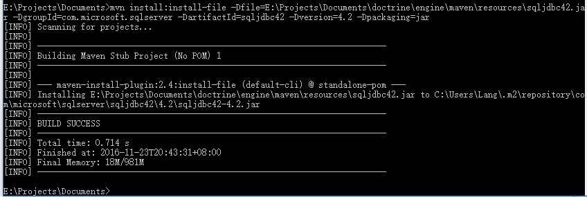

# Maven本地环境创建

## 1.Jar下载地址

1. [SQL Server 4.1](resources/sqljdbc41.jar)
2. [SQL Server 4.2](resources/sqljdbc42.jar)
3. [Oracle 7.0](resources/ojdbc7.jar)
4. [JDK 1.8](resources/tools.jar)

## 2.SQL Server本地Maven搭建

1. 使用下边命令

		mvn install:install-file \
			-Dfile=#{PATH} \
			-DgroupId=com.microsoft.sqlserver \ 
			-DartifactId=sqljdbc42 \ 
			-Dversion=4.2 -Dpackaging=jar
2. 在pom.xml中添加如下片段，`jdbc.mssql.version`在根pom.xml中配置，值为`4.2`

		<dependency>
			<groupId>com.microsoft.sqlserver</groupId>
			<artifactId>sqljdbc42</artifactId>
			<version>${jdbc.mssql.version}</version>
		</dependency>
3. 参数说明：`PATH`——下载下来的`jar`在本地的路径
4. 例子

		mvn install:install-file \
			-Dfile=C:\Users\Lang\Dev\Vie\vie\documents\maven\resources\sqljdbc42.jar \
			-DgroupId=com.microsoft.sqlserver \
			-DartifactId=sqljdbc42 \ 
			-Dversion=4.2 -Dpackaging=jar

## 3.Oracle本地Maven搭建

1. 使用下边命令

		mvn install:install-file \
			-Dfile=#{PATH} \
			-DgroupId=com.oracle \
			-DartifactId=ojdbc7 \
			-Dversion=12.1.0.2 -Dpackaging=jar
2. 在pom.xml中添加如下片段，`jdbc.oracle.version`在根pom.xml中配置，值为`12.1.0.2`

		<dependency>
			<groupId>com.oracle</groupId>
			<artifactId>ojdbc7</artifactId>
			<version>${jdbc.oracle.version}</version>
		</dependency>
3. 参数说明：`PATH`——下载下来的`jar`在本地的路径
4. 例子

		mvn install:install-file \
			-Dfile=C:\Users\Lang\Dev\Vie\vie\documents\maven\resources\ojdbc7.jar \ 
			-DgroupId=com.oracle \
			-DartifactId=ojdbc7 \
			-Dversion=12.1.0.2 -Dpackaging=jar

## 4.JDK本地Maven配置

1. 使用下边命令

		mvn install:install-file \
			-Dfile=#{PATH} \
			-DgroupId=com.sun \
			-DartifactId=tools \
			-Dversion=1.8 -Dpackaging=jar
2. 在pom.xml中添加如下片段，`jdk.version`在根pom.xml中配置，值为`1.8`

		<dependency>
        	<groupId>com.sun</groupId>
        	<artifactId>tools</artifactId>
        	<version>${jdk.version}</version>
        	<scope>runtime</scope>
    	</dependency>
3. 参数说明：`PATH`——下载下来的`jar`在本地的路径
4. 例子

		mvn install:install-file \
			-Dfile=C:\Users\Lang\Dev\Vie\vie\documents\maven\resources\tools.jar \
			-DgroupId=com.sun \
			-DartifactId=tools \
			-Dversion=1.8 -Dpackaging=jar

## 5.运行结果

