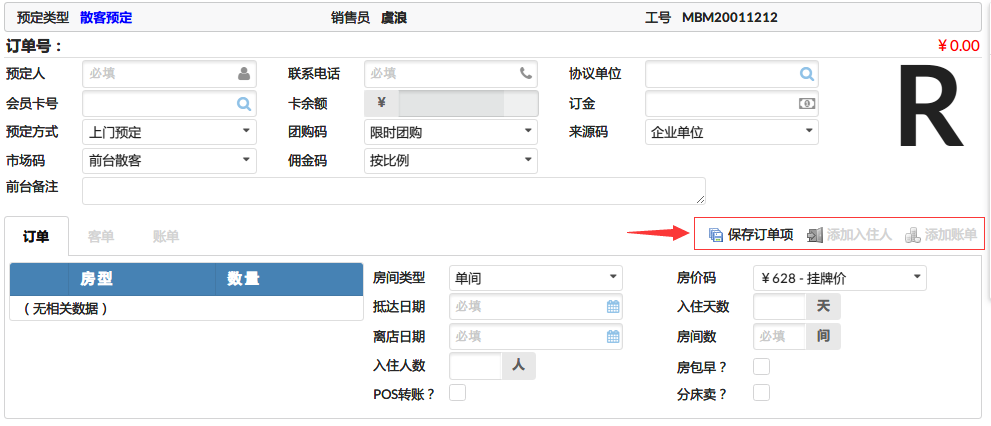
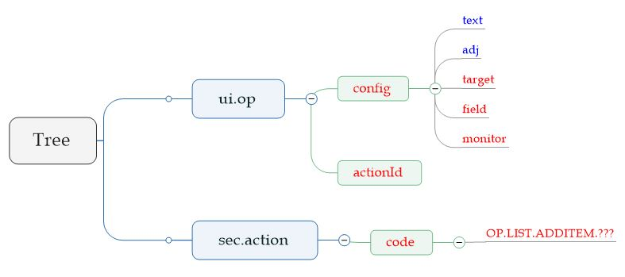

# SPC40001：配置添加Field为List的按钮

## 1.Example

*：该按钮为连接按钮，和上边的Tool Bar对应按钮一样，直接通过Connect的方式连接到Op中执行。

## 2.Tree Map

## 3.Comments

1. 按钮内容配置

		# ui.op -> op.CommonButton
		...
		"config":{
			// Optional
			"text":"预定"
			"adj":"blue",

			// Required
			"target":"fmForm",
			"field":"orderItems",
			"monitor":{
				"inputes":["form","fmForm","values","orderItems"]
			}
		},
		"actionId":{
			"$REF$":"(sec.action,code=OP.LIST.ADDITEM.ROOM-TYPE)"
		}
	*	Optional：如果按钮使用连接模式，按钮本身隐藏，text和adj两个属性可以不配置；
	*	Required：必须配置三个核心属性；
		*	target：子表单的值最终写入的Form的名称（form = ?）
		*	field：子表单的值最终写入的Form中的字段的名称（name = ?）
		*	monitor：当前按钮触发时需要判断当前操作是添加还是更新，所以需要配置monitor用于捕获该字段的原始值

2. 安全操作配置

		# sec.action
		"code": "OP.LIST.ADDITEM.ROOM-TYPE"
	*	sec.action中的配置不带Remote部分，code必须以`OP.LIST.ADDITEM`开头

## 4.Development

**Constant Values**

* `$LIST$`：如果没有配置field，默认的field为$LIST$；
* `$INDEX$`：和左边的DataList操作，如果DataList支持——编辑、删除，则行的id为$INDEX$字段值；

**Code**

	File: rtv/src/plot/state/State.Form.js （ _additem函数 ）

## 5.State Moving

From

To

