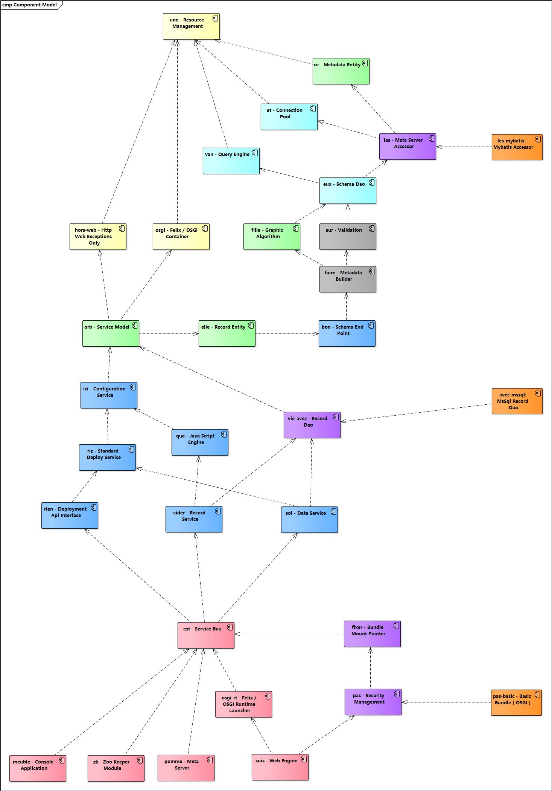

## 6. 重要接口分析

### 6.1. vie-une项目——Resource Management

#### 1. `Cache`接口

Package：com.vie.cache

Definition

    public interface Cache{
        <V> V get(String key);
        <V> void put(String key, V value);
        int size();
        void clean();
        Set<String> keys();
    }
Description

* 系统全局缓存接口，默认实现：`com.vie.cache.inject.MemoryCache`；
* 可扩展该组件，使用其他缓存实现，如Hazelcast或Redias；
* 配置文件信息：src/main/resources/engine/injections.properties；            

        cache.manager=com.vie.cache.inject.MemoryCache；

#### 2. `Value`接口

Package：com.vie.shared

Definition

    public interface Value<R>{
        R getValue();
        void setValue(R value);
        Type getType();
        DataType getDataType();
        String literal();
        boolean isCorrect();
    }
Description

* 系统最底层数据类型接口，主要用于自定的不同数据类型实现
* 目前系统自定义类型包括10种：BinaryType, BooleanType, DateType, DecimalType, IntType, JsonType, LongType, ScriptType, StringType, XmlType
* Record对象中的值全部使用的是Value接口的数据类型，而不是Java类型

#### 3. `Inceptor`接口

Package：com.vie.une

Definition

    public interface Inceptor {
        long getLong(String key);
        int getInt(String key);
        boolean getBoolean(String key);
        String getString(String key);
        String[] getArray(String key);
        Class<?> getClass(String key);
        String getFile();
        boolean contains(String key);
    }

Description

* 资源管理器的专用接口，用于访问engine目录下的所有Properties文件，实现类位于`com.vie.une.inceptor`，和根目录的资源文件实现一一绑定；
* 使用Inceptor时从InceptBus类中直接用Selector模式操作，InceptBus相当于实现选择的总线结构；
* 很特殊的一个是`com.vie.une.impl.DynamicInceptor`，这个类用于动态读取耳机目录下的资源文件，并且不和资源文件绑定；
* 关于资源文件的基础绑定以及传入的初始化的`Inceptor`的键值参考InceptBus源代码；

### 6.2. vie-osgi项目——Felix / OSGI Container

#### 1. `Extrait<T>`接口

Package：com.vie.osgi

Definition

    public interface Extrait<T> {
        T extrait(BundleContext context, String resource) throws AbstractOsgiException;
    }

Description

* Bundle内部资源提取接口，目前实现主要包括五种数据格式：URL，Properties，String，JsonArray，JsonObject；
* 如果不抛出任何`AbstractOsgiException`则证明读取资源成功，返回值就是对应提取的数据类型；
* 这个接口的实现在本项目的`com.vie.osgi.impl`包中；

#### 2. `Container`接口

Package：com.vie.osgi

Definition

    public interface Container {
        boolean initContainer(Map<String, String> options);
        boolean installBundles(String folder) throws BundleException;
        void startContainer() throws BundleException;
        Framework getContainer();
    }

Description

* 这个接口为Osgi容器专用接口，负责容器初始化、系统Bundle的安装、容器的启动（默认会启动安装好的Bundle）；
* 最后一个方法会提取Framework为上层使用，Service读取服务引用时候会使用到该方法；

### 6.3. vie-ce项目——Metadata Entity

#### 1. `Entity`接口

Package：com.vie.ce

Definition

    public interface Entity extends Serializable, ClusterSerializable {
        void id(Serializable id);
        Serializable id();
        JsonObject toJson();
        Entity fromJson(JsonObject data);
    }

Description

* 底层Entity（和Meta Server中的表对应）的通用接口；
* 主要实现了ID提取，Json序列化/反序列化两种核心方法，并且实现了Vert.X做Cluster时的核心方法；
* 实现类位于：`com.vie.ce.impl`中，目前主要包含15种元数据对象，两个大类分别为Vert.X核心配置以及Database核心配置；

#### 2. `Schema`接口 -> `Constraints, Metadata`

Package：com.vie.sur

Definition

    public interface Schema extends Constraints, Metadata, Serializable {
        Set<String> fieldNames();
        String identifier();
        String getTable();
        MetaPolicy getPolicy();
        PEField getColumn(String column);
        PEField getField(String field);
        
        // 下边方法继承于Constraints
        Set<String> getColumns();
        List<PEField> getPrimaryKeys();
        List<PEField> getForeignField();
        List<PEKey> getForeignKey();

        // 下边方法继承于Metadata
        Serializable totem();
        Serializable totem(Serializable metaId);
        void synchronize(Serializable metaId);
        PEMeta meta();
        PEKey[] keys();
        PEField[] fields();
        void meta(PEMeta meta);
        void keys(PEKey... keys);
        void fields(PEField... fields);
    }

Description

* 程序不能访问到`Constraints`和`Metadata`两个接口，这两个接口是`DEFAULT`的Scope；
* 所有访问Schema的位置只能直接访问`Schema`接口，目前实现类`com.vie.sur.impl.JsonSchema`；
* 这个接口不属于`vie-ce`项目，但因为其特殊性以及和底层联系紧密，所以放在`vie-ce`中，并且包名未做变更，延续`vie-sur`（Schema Validation）；

### 6.4. vie-van项目——Query Engine

#### 1.`Expression`接口

Package：com.vie.van

Definition

    public interface Expression {
        String toSql();
        boolean isComplex();
    }

Description

* 查询引擎专用接口，用于生成WHERE条件语句；
* 使用时候主要是用`com.vie.van.impl.Restrictions`中的系列静态方法：
    * eq：等于
    * neq：不等于
    * lt：小于
    * le：小于等于
    * gt：大于
    * ge：大于等于
    * like：匹配：LIKE语句
    * isNull：为空
    * isNotNull：不为空
    * and：复杂语句连接：AND语句
    * or：复杂语句连接：OR语句
* 可继续扩展该接口添加对应的新语句，比如IS IN等更多复杂SQL基础查询接口；

### 6.5. vie-et项目——Connection Pool

#### 1.`JdbcPool`接口

Package：com.vie.pool

Definition

    public interface JdbcPool {
        JdbcOperations getExecutor();
        DataSource getDataSource();
        String getCategory();
        Inceptor getLoader();
    }

Description

* 主要用于连接池的实现，目前使用实现类：`com.vie.pool.impl.BoneCPPool`；
* 配置文件信息：src/main/resources/engine/injections.properties； 

        database.data.pool=com.vie.pool.impl.BoneCPPool
* 可替换连接池，并且设置对应的连接池配置；

#### 2.`JdbcConnection`接口

Package：com.vie.jdbc

Definition

    public interface JdbcConnection {
        List<String> select(String sql, String column);
        List<ConcurrentMap<String, String>> select(String sql, String[] columns);
        Long count(String sql); 
        List<ConcurrentMap<String, Value<?>>> select(String sql, List<Value<?>> values,
            ConcurrentMap<String, DataType> columnMap, String... columns);
        Value<?> insert(String sql, List<Value<?>> values, boolean isRetKey, DataType retType);
        Metadata getMetadata(String category);
        int execute(String sql, List<Value<?>> values); 
        int executeBatch(String sql);
        boolean executeSql(InputStream sqlFile);
    }

Description

* 该接口定义了所有最终访问Transaction Database的基础方法，大部分方法都通过此方法演变；
* 核心数据库方法包括：映射查询（Column Mapping），条件查询（Conditional Query），标识插入（Identifier Insert），语句执行（Execute），文件导入（SQL File Loading）
* 所有的值部分使用的都是`Value`接口；

#### 3. `JdbcTransducer`接口

Package：com.vie.elle

Definition

    public interface JdbcTransducer {
        void injectArgs(PreparedStatement stmt, int idx, Value<?> value) throws SQLException;
        Value<?> getValue(ResultSet retSet, DataType type, String column) throws SQLException, AbstractDatabaseException;
        ... 静态的这里不列举
    }

Description

* 该接口主要辅助Jdbc的两个核心功能：1）参数设置；2）查询提取（*：不同的数据库使用的内容可能不同）
* 配置文件信息：src/main/resources/engine/injections.properties； （键值：`database.data.transducer`）
* 和其他Injections内容不同是这个配置是可选的，如果不提供则使用默认实现：`com.vie.util.jdbc.DataTransducer`，已经可满足大部分SQL数据库；

### 6.6. vie-les项目——Meta Server Accessor（Injection Point）

#### 1.`MetaAccessor`接口

Package：com.vie.les

Definition

    public interface MetaAccessor { 
        Entity insert(Entity entity) throws AbstractTransactionException;
        List<Entity> insert(Entity... entity) throws AbstractTransactionException;
        Entity update(Entity entity) throws AbstractTransactionException;
        boolean deleteById(Serializable uniqueId) throws AbstractTransactionException;
        boolean deleteById(Serializable... uniqueId) throws AbstractTransactionException;
        boolean deleteList(String whereClause) throws AbstractTransactionException;
        boolean purge() throws AbstractTransactionException;
        List<Entity> queryList(String whereClause);
        Entity getById(Serializable uniqueId);
        List<Entity> getAll();
        List<Entity> getByPage(int index, int size, String orderBy);
        long count();
        boolean initialize(final String file) throws AbstractTransactionException;
    }

Description

* 用于访问Meta Server的底层接口，这个接口已经提供了实现：`com.vie.les.impl.MetaAccessorImpl`，使用Bridge的设计模式；
* 配置文件信息：src/main/resources/engine/injections.properties； 

        meta.accessor=com.vie.les.mybatis.impl.IBatisAccessorImpl
* 这个项目必须使用另外一个项目提供实现（并且非Bundle模式），默认使用为`vie-bundle/vie-les-mybatis`，访问的Meta Server为H2；
* 如果需要替换Meta Server则不仅仅是开发一个实现类，而是开发整个项目，最终提供Accessor实现的访问方法，并且需要访问所有Entity；
* 上边的配置：`com.vie.les.mybatis.impl.IBatisAccessorImpl`在整个Vie Framework中是没有的，而是位于`vie-bundle`独立项目，使用Jar包的方式接入，引用了该Jar包过后，这个类就可以被Injections读取到；

### 6.7. vie-eux项目——Schema Dao

#### 1.`Serializer`接口

Package：com.vie.eux

Definition

    public interface Serializer {
        PEMeta transferMeta(final JsonObject meta) throws SerializationException;
        List<PEKey> transferKeys(final JsonArray keys) throws SerializationException;
        List<PEField> transferFields(final JsonArray fields) throws SerializationException;
        List<PEIndex> transferIndexes(final JsonArray indexes) throws SerializationException;
    }

Description

* 元数据序列化接口，用于将JsonObject和JsonArray转换成Schema的核心Entity；
* Schema的核心Entity主要包含四部分内容：Meta, Key, Field, Index（Index目前未实现）；
* 主要使用在将Json文件转换成Meta Server中结构化的数据模型时执行序列化操作；

#### 2.`DataValidator`接口

Package：com.vie.eux

Definition

    public interface DataValidator {
        AbstractSchemaException verifyTable(String table);
        AbstractSchemaException verifyColumn(String table, String column);
        AbstractSchemaException verifyConstraint(String table, String column);
        AbstractSchemaException verifyColumnType(String table, String column, String expectedType);
    }

Description

* Schema验证专用特殊接口，用于执行四个验证：
    * 1）验证数据库中表是否存在；
    * 2）验证数据库中表对应列是否存在；
    * 3）验证数据库中列的约束是否匹配；
    * 4）验证数据库中列的数据类型是否正确；
* Schema验证时针对特殊验证会访问到Transaction Database，该接口为这些行为量身打造；

#### 3.`SchemaDao`接口

Package：com.vie.eux

Definition

    public interface SchemaDao {
        Schema save(Schema schema) throws AbstractTransactionException;
        boolean delete(String identifier) throws AbstractTransactionException;
        List<String> purge() throws AbstractTransactionException;
        Schema get(String identifier) throws AbstractTransactionException;
        ConcurrentMap<String, String> get() throws AbstractTransactionException;
    }

Description

* 提供`Schema`的数据访问层接口，用于添加、删除、查询、修改等基本操作；
* `Schema`接口会读取Meta、Field、Key、Index四部分信息，整合成完整的基于Record的Schema结构；

#### 4.`ReflexDao`接口

Package：com.vie.avec

Definition

    public interface ReflexDao {
        String getFile();
        Edges getRelations();
    }

Description

* 关系计算接口，用于从数据库中读取表和表之间的关系信息；
* 这个接口属于虚拟接口，因为Injection中的配置数据位于上层；

 
（未完待续……）