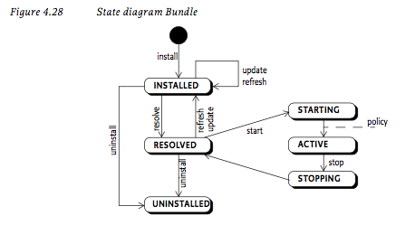

# Bundle 生命周期管理

## 1. LifeCycle

## 2. Instroduction

1. __INSTALLED__：OSGI Runtime安装了当前这个Bundle，在环境里面已经拥有了对应的BundleContext以及BundleId；
2. __RESOLVED__：这个Bundle存在于OSGI的Runtime中并且其前提条件满足（一般是依赖包已经全部找到），有两种状态可以处于这样的情况：
    1. 当前Bundle可以启动了；
    2. 这个Bundle停止过后处于Resolved的状态；
3. __STARTING__：这个Bundle启动完成，如果Bundle中包含了BundleActivator类，那么这个类的`start()`方法将被调用，这个过程完成过后Bundle处于ACTIVE状态。（*：当前这个Bundle可以使用延迟启动（Bundle-ActivationPolicy：Lazy）；
4. __ACTIVE__：当前这个Bundle已经运行在环境中了；
5. __STOPPING__：这个Bundle停止了，如果Bundle中包含了BundleActiviator类，那么这个类的`stop()`方法将被调用，这个过程完成过后Bundle处于RESOLVED状态；
6. __UNINSTALLED__：OSGI Runtime将这个Bundle从运行时中移除；