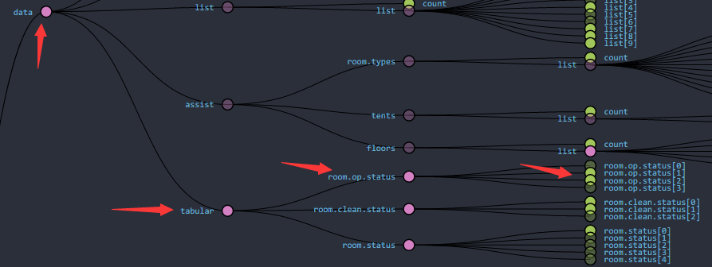
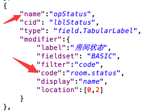
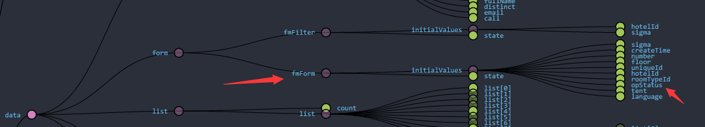

# Form Field -> TabularLabel

## 1.Pre-Condition

## 2.Path

	Source State：data -> tabular -> <typeName>
	Target Value：初始化Form时当前记录中对应的Tabular的ID值

## 3.Configuration

## 4.Comment

* name：该值对应到Form中的initialValues，如下： 

* code：当前Label对应的Tabular的type值，对应到数据库中`S_TYPE`列
* display：当前Label应该显示的字段信息，可配置`SYS_LIST_FIXED`中的任何一列对应的`field`信息
* filter：【可选】——输入字段默认为`uniqueId`，这里设置的值用于过滤Tabular的列表数据

## 5.Shared

* fieldset：在`FieldSetForm`中专用配置
* label：所有的Field类型的控件都会使用的信息