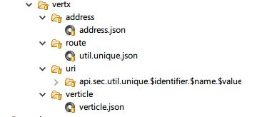
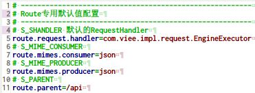
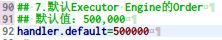
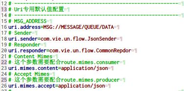
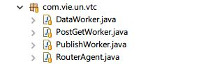

# Restful Config

* 配置目录：/vertx/ 

* 配置术语：
	* Required——配置文件中必须出现的属性；
	* Forbidden——配置文件中不允许的属性，系统生成或固定值；
	* Optional——配置文件中可选属性，即使不出现会有【默认值】；

## 1. Meta Model

### 1.1. PEAddress

**Json Format**

	{
		"uniqueId":"（Generated）系统自动生成，不出现在配置文件中",
		"workClass":"处理地址上的Worker类型Verticle",
		"consumerAddr":"消费地址Address",
		"consumerHandler":"消费Address后响应的Java类"
	}
* **uniqueId**：Forbidden
	* Default——（Generated）系统生成
	* Format——UUID格式
* **workClass**：Required
	* Default——（None）
	* Format——Java类名，反射处理，该类必须从`com.viee.fantasm.AbstractWorker`继承
* **consumerAddr**：Required
	* Default——（None）
	* Format——字符串类型，以`MSG://MESSAGE/QUEUE`开头，消息地址信息
* **consumerHandler**：Required
	* Default——（None）
	* Format——Java类名，反射处理，该类必须从`com.viee.fantasm.AbstractReplier`继承，并且实现接口`com.viee.MessageReplier<T>`，其中`T`为默认响应的数据类型

### 1.2. PEVerticle

**Json Format**

	{
		"uniqueId":"（Generated）系统自动生成，不出现在配置文件中",
		"name":"VertX所需要的Verticle的Java类名",
		"instances":"Verticle需要发布的实例的个数",
		"group":"Verticle运行的Group组的默认值，可实现Verticle的分组",
		"jsonConfig":"Verticle实例运行需要的Json配置",
		"isolatedClasses":"Verticle配置信息中所需要的类集合",
		"extraCp":"Verticle配置中所需要的CLASSPATH",
		"ha":"是否启用HA功能",
		"worker":"当前Verticle是否一个Worker",
		"multi":"当前Verticle是否一个Multi Thread类型"
	}
* **uniqueId**：Forbidden
	* Default——（Generated）系统生成
	* Format——UUID格式
* **name**：Required
	* Default——（None）
	* Format——Java类名，反射处理，该类必须从`com.viee.fantasm.AbstractWorker`继承
* **instances**：Optional
	* Default——（1）
	* Format——数值类型，Verticle的实例数量，默认为1
* **group**：Optional
	* Default——（__DEFAULT__）
	* Format——组名称，启用HA的时候必须该属性
* **jsonConfig**：Optional
	* Default——（{}）
	* Format——Json格式的数据，默认空配置
* **isolatedClasses**：Optional
	* Default——（[]）
	* Format——JsonArray格式
* **extraCp**：Optional
	* Default——（[]）
	* Format——JsonArray格式
* **ha**：Optional
	* Default——（false）
	* Format——Boolean值，是否启用HA功能
* **worker**：Optional
	* Default——（false）
	* Format——Boolean值，是否是一个Worker类型的Verticle
* **multi**：Optional
	* Default——（false）
	* Format——Boolean值，是否是一个Multi Thread类型的Verticle

### 1.3. PERoute

Route专用配置： 

	src/main/resources/engine/uri.properties

**Json Format**

	{
		"uniqueId":"（Generated）系统自动生成，不出现在配置文件中",
		"parent":"父Restful路径",
		"path":"系统访问的Restful路径",
		"consumerMimes":"消费MIME类型",
		"producerMimes":"生成MIME类型",
		"requestHandler":"处理路径对应Handler信息",
		"failureHandler":"处理路径对应出错的Failure Handler信息",
		"order":"处理当前Restful路径的Handler对应的Order",
		"method":"处理当前Restful路径的Http Method"
	}
* **uniqueId**：Forbidden
	* Default——（Generated）系统生成
	* Format——UUID格式
* **parent**：Optional
	* Default——（/api）
	* Format——【可配置】以`/`开始，默认为`/api`，标记了当前Restful的根路径
	* Key——route.parent
* **path**：Required
	* Default——（None）
	* Format——以`/`开始，可支持`:name`这种Pattern信息
* **consumerMimes**：Optional
	* Default——（json）
	* Format——可支持的消费的Mime类型数组格式（可配置到Resolver中）
	* Key——route.mimes.consumer
* **producerMimes**：Optional
	* Default——（json）
	* Format——可支持的生产的Mime类型数组格式（可配置到Resolver中）
	* Key——route.mimes.producer
* **requestHandler**：Optional
	* Default——（com.viee.impl.request.EngineExecutor）
	* Format——Java类名，反射处理，必须实现`io.vertx.core.Handler<T>`接口
	* Key——route.request.handler
* **failureHandler**：Optional
	* Default——（NULL）
	* Format——Java类名，反射处理，必须实现`io.vertx.core.Handler<T>`接口
* **order**：Optional
	* Default——（500000）
	* Format——数值类型，配置文件如下：`src/main/resources/engine/handler/orders.properties`
	* Key——handler.default 

* **method**：Optional
	* Default——（GET）
	* Format——字符串类型，可转换成：`io.vertx.core.http.HttpMethod`

### 1.4. PEUri

URI专用配置： 

	src/main/resources/engine/uri.properties

**Json Format**

	{
		"uniqueId":"（Generated）系统自动生成，不出现在配置文件中",
		"uri":"等价于Route中的Parent + Path，配置的可访问的URI全地址",
		"method":"当前Uri对应的HTTP Method值",
		"paramType":"参数类型——QUERY | FORM | BODY | CUSTOM",
		"requiredParam":"当前接口必须参数表",
		"identifier":"当前接口对应的全局ID信息"
		"address":"当前接口需要发送数据对应的目标消息地址：Message Address",
		"script":"当前接口关联的JS脚本名称",
		"returnFilters":"该接口返回信息时需要过滤的字段信息，当前信息会被返回结果集排除",
		"contentMimes":"服务端偏好：对应到服务端处理ContentType的Http头",
		"acceptMimes":"客户端偏好：对应到服务端处理AcceptType的Http头",
		"sender":"当前Uri发送信息使用的Sender",
		"responder":"当前Uri接收信息需要使用的Responder"
	}
* **uniqueId**：Forbidden
	* Default——（Generated）系统生成
	* Format——UUID格式
* **uri**：Required
	* Default——（None）
	* Format——以`/`为开始的字符串格式，合法URI地址，和Route中的值匹配
* **method**：Optional
	* Default——（GET）
	* Format——字符串类型，可转换成：`io.vertx.core.http.HttpMethod`
* **paramType**：Optional
	* Default——（QUERY | BODY）
	* Addtional——如果method为GET则默认QUERY，method为其他则默认BODY
	* Format——四个值用于标识当前Restful接口的类型
		* QUERY：用于GET请求中URI地址的QueryString参数类型
		* FORM：一般用于POST请求，Http中的`<form>`标记用的表单参数类型
		* BODY：一般用于非GET请求，放在Http请求的Body中
		* CUSTOM：其他参数类型
* **identifier**：Required
	* Default——（None）
	* Format——关联到Meta中的Model对应的全局ID，可支持`${}`格式从请求节点中读取
* **address**：Optional
	* Default——（MSG://MESSAGE/QUEUE/DATA）
	* Format——字符串类型，对应当前Uri最终发送数据的目标消息地址Message Address
	* Key——uri.address
* **script**：Optional
	* Default——（Calculate）
	* Format——一般是根据Uri计算最终的script名称
* **returnFilters**：Optional
	* Default——（[]）
	* Format——当前URI发送信息返回值的Fields集合
* **contentMimes**：Optional
	* Default——（["application/json"]）
	* Format——当前Restful接口处理服务端偏好ContentType支持的MIME类型
	* Key——uri.mimes.content
* **acceptMimes**：Optional
	* Default——（["application/json"]）
	* Format——当前Restful接口处理客户端偏好AcceptType支持的MIME类型
	* Key——uri.mimes.accept
* **sender**：Optional
	* Default——（com.vie.un.flow.JsonSender）
	* Format——Java类名，反射处理，必须实现接口`com.viee.MessageAsker<T>`
	* Key——uri.sender
* **responder**：Optional
	* Default——（com.vie.un.flow.CommonRepdor）
	* Format——Java类名，反射处理，必须实现接口`com.viee.Responder<T>`
	* Key——uri.responder

#### 1.4.1. PEScript

**Json Format**

	{
		"uniqueId":"（Generated）系统自动生成，不出现在配置文件中",
		"name":"脚本名称",
		"namespace":"脚本名空间",
		"content":"脚本内容"
	}
* **uniqueId**：Forbidden
	* Default——（Generated）系统生成
	* Format——UUID格式
* **name**：Required
	* Default——（None）
	* Format——脚本名称，用于访问PEScript的UniqueKey值
* **namespace**：Optional
	* Default——（None）
	* Format——脚本名空间字符串
* **content**：Optional
	* Default——（读入script.js中的文件内容）
	* Format——如果存在则改变JS文件名，如果不存在则直接访问script.js

#### 1.4.2. PERule

**Json Format**

	{
		"uniqueId":"（Generated）系统自动生成，不出现在配置文件中",
		"name":"需要处理的参数名称",
		"type":"需要处理的参数类型",
		"order":"处理顺序"
		"componentType":"处理组件类型：VALIDATOR | CONVERTOR | DEPENDANT",
		"componentClass":"处理组件的类名",
		"config":"组件需要的Json格式的配置数据",
		"errorMessage":"该组件处理过后显示在UI的数据信息",
		"refUID":"系统自动挂载——关联对应的PEUri"
	}
* **uniqueId**：Forbidden
	* Default——（Generated）系统生成
	* Format——UUID格式
* **name**：Required
	* Default——（None）
	* Format——字段名称，用于验证字段具体信息
* **type**：Required
	* Default——（StringType）
	* Format——参数类型信息
* **order**：Required
	* Default——（None）
	* Format——处理顺序，数值类型
* **componentType**：Required
	* Default——（VALIDATOR）
	* Format——字符串类型，最终会处理成ComponentType的Enum类型执行转换
		* VALIDATOR：验证器
		* CONVERTOR：转换器
		* DEPENDANT：依赖器
* **componentClass**：Required
	* Default——（None）
	* Format——Java类，反射处理，必须根据类型执行反射
* **config**：Required
	* Default——（{}）
	* Format——处理组件需要的Json格式的配置数据
* **errorMessage**：Required
	* Default——（None）
	* Format——一般是用于验证器验证的错误信息，或者当前Rule处理的错误信息
* **refUID**：Forbidden
	* Default——（Generated）系统生成
	* Format——根据父目录执行关联操作

## 2. Java Reflection

### 2.1. Verticle

* com.vie.un.vtc.DataWorker——【Request】请求Worker，数据接口，处理POST/GET/DELETE/PUT方法
* com.vie.un.vtc.PostGetWorker——【Request】分页请求Worker，数据接口，POST方法查询
* com.vie.un.vtc.PublishWorker——【Core】后台Worker，启动时Publish配置数据到ZooKeeper中
* com.vie.un.vtc.RouterAgent——【Core】Standard的Verticle，核心路由组件

### 2.2. ConsumerHandler （Address）

* com.vie.un.flow.DataReplier——【Message Reply】数据接口消息响应器，处理POST/GET/DELETE/PUT方法（Default）
* com.vie.un.flow.MetaReplier——【Message Reply】元数据接口消息响应器，处理POST/GET/DELETE/PUT方法
* com.vie.un.flow.PostGetReplier——【Message Reply】POST方法查询响应器，处理POST请求执行查询，主要用于分页

### 2.3. Sender（Uri）

* com.vie.un.flow.JsonSender——【Sender】Json数据发送器（Default）

### 2.4. Reponder（Uri）

* com.vie.un.flow.CommonRepdor——【Respondor】Json格式处理器（Default）
* com.vie.un.flow.FailureRepdor——【Respondor】Failure处理器（Default）
* com.vie.un.flow.JObjectRepdor——【Respondor】针对Array/Object同时Json序列化处理
* com.vie.un.flow.LogicalRepdor——【Respondor】响应出TRUE/FALSE的逻辑响应器

### 2.4. Component（Rule）

代码块为`config`参数合法内容

* com.vie.un.uca.EncryptConvertor——【Convertor】密码加密器

		{
			"algorithm":"MD5"
		}
* com.vie.un.uca.LengthValidator——【Validator】长度验证器

		{
			"minLength":1,
			“maxLength":40
		}
* com.vie.un.uca.MissingValidator——【Validator】字段是否存在的验证器

		{
			"identifier":"sec.user",
			"field":"username"
		}
* com.vie.un.uca.RegexValidator——【Validator】正则表达式验证器

		{
			"regex":"xxxx"
		}

## 3. Selected Value

* PERoute
	* method——`GET | POST | DELETE | PUT | OPTION`
* PEUri
	* method——`GET | POST | DELETE | PUT | OPTION`
	* paramType——`QUERY | FORM | BODY | CUSTOM`
* PERule
	* componentType——`VALIDATOR | CONVERTOR | DEPENDANT`