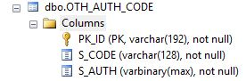
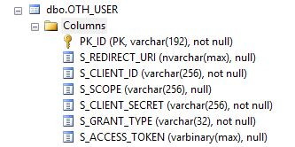
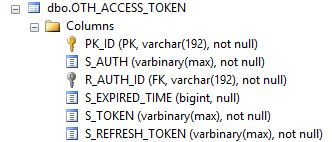
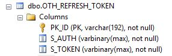

# OAuth接口设计 - Authorization Code Grant

## 1.Workflow

## 2.Database

### 2.1.`OTH_AUTH_CODE`

* `PK_ID`：GUID格式，第一次访问授权服务器时的临时授权码的数据库代理主键；
* `S_CODE`：授权码值，使用随机算法生成的授权码的值，最终返回到客户端的code信息；
* `S_AUTH`：二进制码

### 2.2.`OTH_USER`

* `PK_ID`：访问OAuth的客户端需要使用的数据库代理主键；
* `S_REDIRECT_URI`：【第三方终端使用】如果使用了另外的终端需要回调URI时则使用该字段信息；
* `S_CLIENT_ID`：客户端的ID信息（如果是用户登录则是用户的ID信息）；
* `S_SCOPE`：当前Token需要使用的范围；
* `S_CLIENT_SECRET`：启用了OAuth人证时需要使用的客户端密钥；
* `S_GRANT_TYPE`：记录了OAuth的授权类型；

### 2.3.`OTH_ACCESS_TOKEN`

* `PK_ID`：OAuth最终生成的令牌的数据库代理主键；
* `S_AUTH/R_AUTH_ID`：关联到授权码的具体信息，除了ID信息以外，还包含`S_AUTH`的授权码的内容；
* `S_TOKEN`：OAuth生成的Token详细信息；

### 2.4.`OTH_REFRESH_TOKEN`

* `PK_ID`：刷新令牌的数据库代理主键；
* `S_AUTH`：刷新令牌所需要的授权码的内容；
* `S_TOKEN`：刷新令牌的令牌值；

## 3.Restful Api

### 3.1.OAuth Login

* Api：`/api/oth/login`
* Request：

		{
			"username":用户本身的用户名,
			"password":用户的密码（MD5加密过）
		}
* Response（Data部分）

		{
			....用户信息
			"token":"<登录过程拿到的Token>"
		}

完整登录代码流程：

1. 用户提供`username`和`password`，`password`必须是通过MD5加密过的；
2. 通过`username`和`password`拿到用户的`uniqueId`，使用该`uniqueId`直接从`OAH_USER`表中读取`accessToken`信息；
3. 如果当前用户的`accessToken`信息为NULL，则读取`clientSecret`和`clientId`信息，执行授权码交换Token流程（该操作在Client客户端做）；
4. 如果当前用户的`accessToken`的信息拿到过后，则访问`OAH_ACCESS_TOKEN`表检查当前Token是否过期，如果过期则执行RefreshToken流程；
5. 最终返回的信息中必须带`token`信息用于在访问资源服务器时的核心令牌信息

### 3.2. Code Request

* Api：`/api/oth/authorize`
* Request：

		{
			"client_id":当前用户使用的CLIENT_ID,
			"client_secret":通过用户名以及密码拿到的secret信息,
			"response_type":该值必须固定值code
			"scope":和后台的Realm值对应
			"state":透明值，放只跨站点访问请求用
		}

* Response：

		{
			"code":申请的临时授权码
			"state":透明值，如果客户端提供了该参数则使用客户端参数，如果没提供则由服务端生成
		}

完整的授权码申请流程：

1. 用户提供`username`和`password`，`password`必须是通过MD5加密过的；
2. 得到`uniqueId`作为`clientId`，并且读取当前用户的OAuth记录（`OTH_USER`表），读取记录的时候基本参数：
	1. `client_id`匹配；
	2. `client_secret`匹配；
	3. `response_type`匹配；
	4. `scope`匹配；
4. 第二步如果可以读取到当前客户的OAuth记录，则生成临时授权码返回（`OTH_AUTH_CODE`表）

### 3.3. Token Request

* Api：`/api/oth/token`
* Request：

		{
			"grant_type":该值必须是authorization_code,
			"code":在Code Request流程中拿到的授权码信息,
			"client_id":客户端标识，即上边提到的用户的ID信息
		}
* Response：

		{
			"access_token":服务器发放的AccessToken的值,
			"token_type":固定值，看使用的Token的模式，默认使用bearer,（不返回）
			"expires_in":通过转换过后的时间值,
			"refresh_token":启用了刷新功能过后，在生成token的同时产生刷新令牌信息,
			"scope":当前token的使用范围信息，和服务端的Realm的值对应，（不返回）
		}

完整的Token申请流程：

1. 用户从Code Request流程中已经拿到`code`信息，则将`client_id`，`code`作为参数执行Token的申请流程；
2. 检查`grant_type`是否是`authorization_code`的值；
3. 使用`authorization_code`、`code`、`client_id`检查用户记录，如果用户记录存在则生成令牌信息，访问`OTH_USER`表
4. 用户记录检查合格则直接在`OTH_ACCESS_TOKEN`和`OTH_REFRESH_TOKEN`中生成令牌记录以及刷新令牌记录；
5. 最终返回合法的令牌到客户端，将Token传回给用户；

### 3.4. Refresh Token

在Token过期的时候触发Refresh Token的流程，Refresh Token流程会将系统中的令牌进行刷新；

* Api：`/api/oth/refresh`
* Request:

		{
			"grant_type":该值必须是refresh_token,
			"refresh_token":在生成令牌时返回的刷新令牌的值,
			"scope":当前refresh token的使用范围信息，和服务端的Realm的值对应
		}
* Response：和Token Request的返回值一致

完整的Refresh Token流程：

1. 当用户在Token Request中检测到Token过期时，则表示当前Token需要刷新，执行刷新令牌的流程；
2. 检查`grant_type`是不是refresh_token的值；
3. 通过`refresh_token`的值从`OTH_ACCESS_TOKEN`中读取原始记录的值，查询是否有值关联当前的`refresh_token`；
4. 检查`OTH_ACCESS_TOKEN`中的`S_AUTH`字段和`OTH_REFRESH_TOKEN`表中的`S_AUTH`中是否匹配，如果匹配则刷新令牌请求有效；
5. 使用一个新的`S_AUTH`值生成新的令牌信息，并且将`OTH_REFRESH_TOKEN`中的记录直接刷新，生成新的刷新令牌；
6. 将最终生成的新的令牌相关数据返回到客户端；

